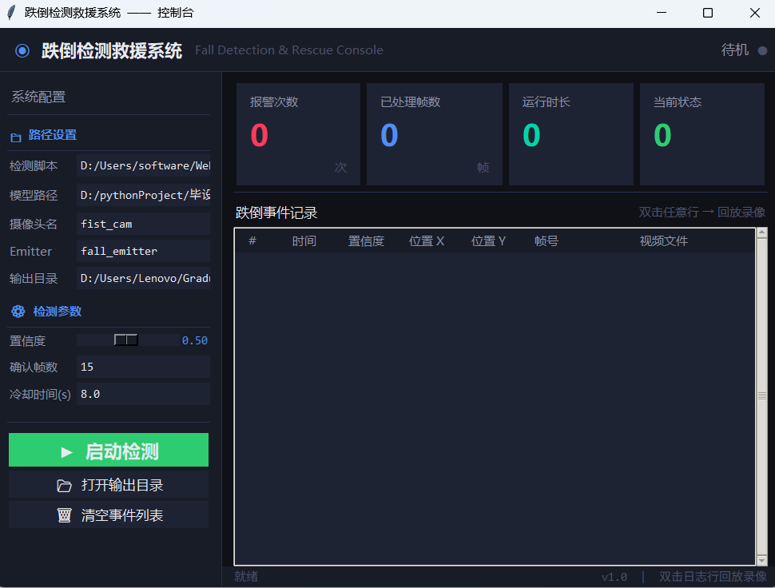
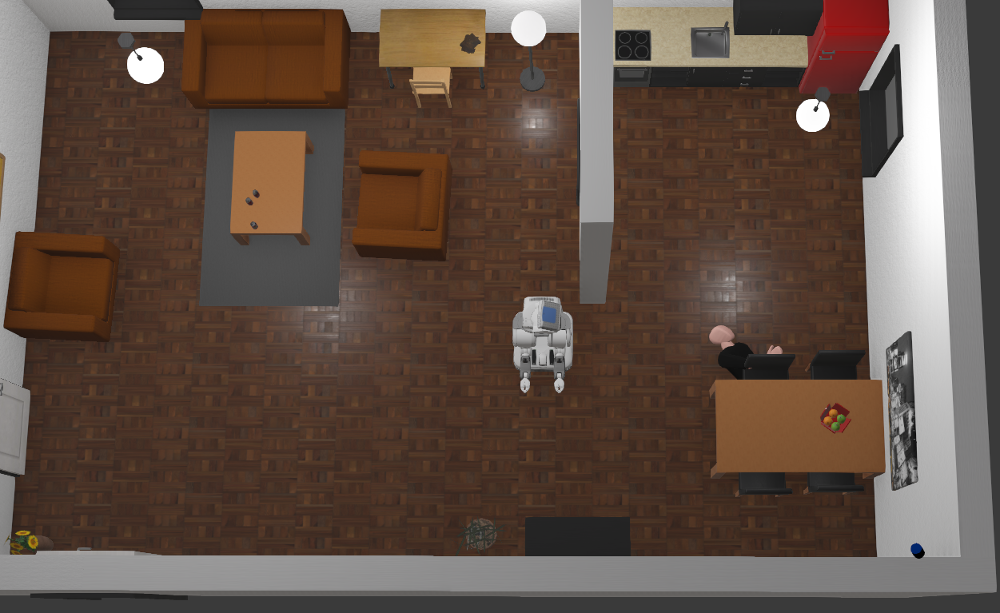
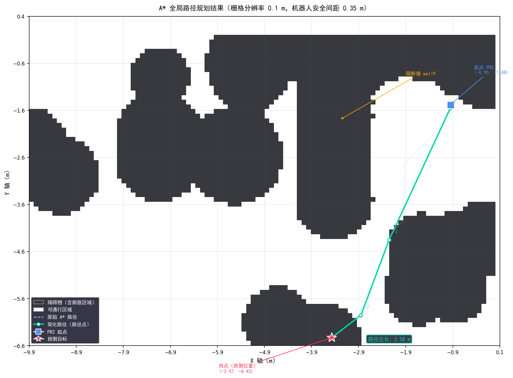
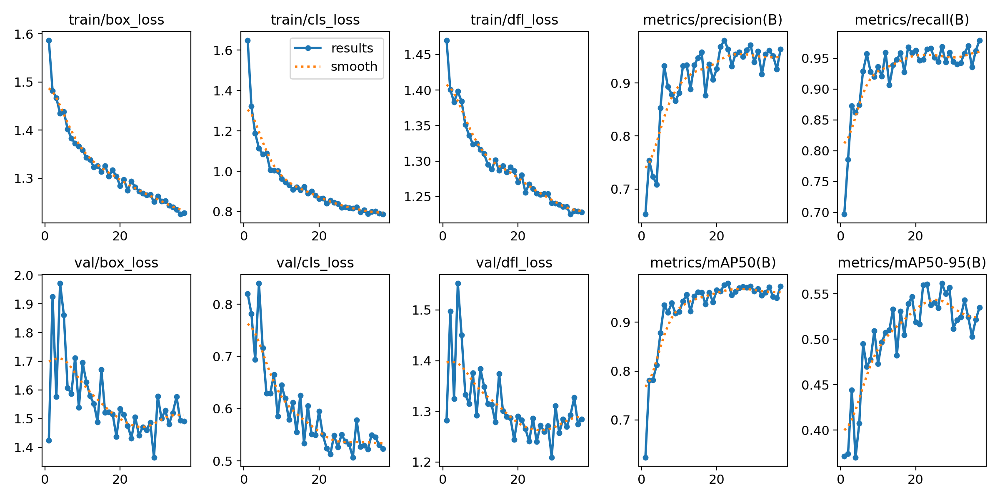

# 基于机器视觉的跌倒检测与救援虚拟系统

**Machine Vision-Based Fall Detection and Rescue Virtual System**

> 本科毕业设计 · 2026

[](https://www.python.org/)
[](https://github.com/ultralytics/ultralytics)
[](https://cyberbotics.com/)
[](LICENSE)

---

## 项目简介

本项目针对老龄化背景下独居老人跌倒后无法得到及时救援的现实问题，构建了一套集**跌倒检测、实时告警与机器人自主救援**于一体的仿真系统。

系统以 Webots 为仿真平台，YOLOv8 为检测核心，A\* 算法为导航方案，实现了从跌倒事件感知到 PR2 机器人自主导航救援的完整闭环流程。

---

## 系统架构

```
图形化控制台 (fall_detection_ui.py)
        │  subprocess 启动 + 环境变量传参
        ▼
跌倒检测控制器 (Fall_detection_final.py)   ←── Webots 摄像头
        │  YOLOv8 推理 → 连续帧确认
        │  Supervisor 读取行人世界坐标
        │  Emitter 广播坐标 (channel 1)
        ▼
PR2 救援控制器 (pr2_rescue.py)             ←── GPS / Compass
        │  A* 全局路径规划
        │  栅格地图障碍回避
        ▼
    到达伤者 · 执行救援姿态
```

---

## 效果展示

| 检测报警界面 | PR2 导航过程 |
|:---:|:---:|
|  |  |

**A\* 路径规划可视化：**



**模型训练曲线：**



---

## 性能指标

### 跌倒检测模型（YOLOv8n）

| 指标 | fall 类 | stand 类 | 总体 |
|:---:|:---:|:---:|:---:|
| mAP50 | 0.833 | 0.993 | **0.913** |
| Precision | — | — | 0.827 |
| Recall | — | — | 0.908 |
| F1-Score | — | — | 0.866 |

### 模型横向对比

| 模型 | 参数量 |   mAP50   | 推理速度 |
|:---:|:---:|:---------:|:---:|
| YOLOv5n | 1.9M | **0.891** | — |
| **YOLOv8n（本系统）** | **3.2M** | **0.913** | — |
| YOLOv8s | 11.2M | **0.903** | — |

### 救援导航

- A\* 路径规划成功率：**100%**
- 端到端救援成功率：**98.6%**
- 卡死脱困机制：后退重规划，脱困成功率 100%

---

## 目录结构

```
fall-detection-rescue/
├── controllers/
│   ├── Fall_detection_final/
│   │   └── Fall_detection_final.py   # 跌倒检测 Webots 外部控制器
│   └── pr2_rescue/
│       └── pr2_rescue.py             # PR2 救援导航 Webots 控制器
├── scripts/
│   ├── fall_detection_ui.py          # 图形化控制台（tkinter）
│   ├── visualize_grid.py             # 栅格地图 + A* 路径可视化
│   ├── train_yolov5n.py              # YOLOv5n 对比训练脚本
│   └── train_yolov8s.py              # YOLOv8s 对比训练脚本
├── worlds/
│   └── rescue_scene.wbt              # Webots 仿真场景文件
├── dataset/
│   └── data.yaml                     # 数据集配置（图片不含在仓库中）
├── docs/
│   ├── grid_map_astar.png            # A* 路径规划可视化
│   ├── results.png                   # 模型训练曲线
│   ├── detection_demo.png            # 检测界面截图
│   └── rescue_demo.png               # 救援过程截图
├── requirements.txt
├── .gitignore
└── README.md
```

---

## 环境要求

### 软件依赖

| 软件 | 版本     |
|---|--------|
| Webots | R2025a |
| Python | 3.11   |
| PyTorch | 2.0+   |
| Ultralytics | 8.0+   |
| OpenCV | 4.0+   |
| Pillow | 10.0+  |

### 安装依赖

```bash
pip install -r requirements.txt
```

`requirements.txt` 内容：

```
ultralytics>=8.0
opencv-python>=4.0
pillow>=10.0
numpy>=1.24
matplotlib>=3.7
torch>=2.0
```

---

## 快速开始

### 1. 配置 Webots Python 解释器

打开 Webots → **Tools → Preferences → Python command**，填入 Python 3.11 路径：

```
D:\python311\python311\python.exe   # Windows 示例
```

### 2. 修改 PR2 原型文件

找到 Webots 安装目录下：

```
projects/robots/pal_robotics/pr2/protos/Pr2.proto
```

全局替换：`maxVelocity 15` → `maxVelocity 200`

### 3. 打开仿真场景

用 Webots 打开 `worlds/rescue_scene.wbt`，点击运行按钮启动仿真。

### 4. 启动图形化控制台

```bash
python scripts/fall_detection_ui.py
```

在控制台界面中：
- 填写**检测脚本路径**（`Fall_detection_final.py` 的完整路径）
- 填写**模型路径**（`best.pt` 的完整路径）
- 点击 **▶ 启动检测**

### 5. 触发跌倒测试

在 Webots 场景中修改行人节点的 `FALL_PRESET` 参数（1~5）触发跌倒姿态，观察检测报警与 PR2 自主导航救援全流程。

---

## 模型训练

如需重新训练模型，准备好数据集后运行：

```bash
# 训练 YOLOv8n（本系统主模型）
python -c "from ultralytics import YOLO; YOLO('yolov8n.pt').train(data='dataset/data.yaml', epochs=50)"

# 训练对比模型 YOLOv5n
python scripts/train_yolov5n.py

# 训练对比模型 YOLOv8s
python scripts/train_yolov8s.py
```

训练完成后最优权重保存于 `runs/detect/fall_mixed_v1/weights/best.pt`。

---

## 数据集

本系统训练数据来源：

- **公开数据集**：[Multicam Fall Dataset](http://www.iro.umontreal.ca/~labimage/Dataset/)
  - Auvinet E, Rougier C, Meunier J, et al. Multiple cameras fall dataset[R]. 2010.
- **仿真渲染数据**：通过 Webots 场景中行人模型的 5 种跌倒预设姿态采集

数据集不包含在本仓库中，请自行下载并按 `dataset/data.yaml` 中的路径配置，数据集下载网址：
基于MFD的公开数据集：https://universe.roboflow.com/heartbroker/fall-down-boaou。
基于webots的自建数据集：https://universe.roboflow.com/heartbroker/webot-fall

---

## 核心算法

### A\* 路径规划

- 栅格分辨率：0.1 m/格
- 障碍膨胀半径：物理半径 + 0.35 m（机器人安全间距）
- 启发函数：欧氏距离
- 移动方式：8方向（水平/垂直代价 1.0，对角线代价 1.414）
- 路径简化：贪心直线可达跳跃算法

### 跌倒检测

- 模型：YOLOv8n（anchor-free，解耦检测头）
- 输入尺寸：640 × 640
- 类别：`fall`（跌倒）/ `stand`（正常站立）
- 确认机制：连续 15 帧检测到跌倒方触发报警

---

## 参考文献

```
[1] 黎淑贞. 老人怕跌倒，不得不预防[J]. 解放军健康, 2021(4): 33.
[2] ALAM E, et al. Vision-based human fall detection systems using
    deep learning: A review[J]. Computers in Biology and Medicine,
    2022, 146: 105637.
[3] ISLAM M M, et al. Deep learning based systems developed for fall
    detection: A review[J]. IEEE Access, 2020, 8: 166117-166137.
[4] Habib K, et al. Visionary Vigilance: Optimized YOLOV8 for Fallen
    Person Detection[J]. IMAGE AND VISION COMPUTING, 2024, 149.
[5] AUVINET E, et al. Multiple cameras fall dataset[R]. 2010.
[6] 陈晨, 等. 基于YOLOv8改进的室内行人跌倒检测算法FDW-YOLO[J].
    计算机工程与科学, 2024, 46(8): 1.
[7] Cyberbotics. Webots官方文档[EB/OL]. https://cyberbotics.com/doc.
[8] 赵卫东, 等. 基于A*算法的局部路径规划算法[J].
    安徽工业大学学报(自然科学版), 2023, 40(1): 70-75.
[9] 张振, 等. 融合改进A*算法与DWA算法的机器人实时路径规划[J].
    无线电工程, 2022, 52(11): 1984-1993.
```

---

## License

[MIT License](LICENSE)

---

## 作者

> 本科毕业设计 · 2026  
> 姓名：汪旭  
> 学校：浙江万里学院
